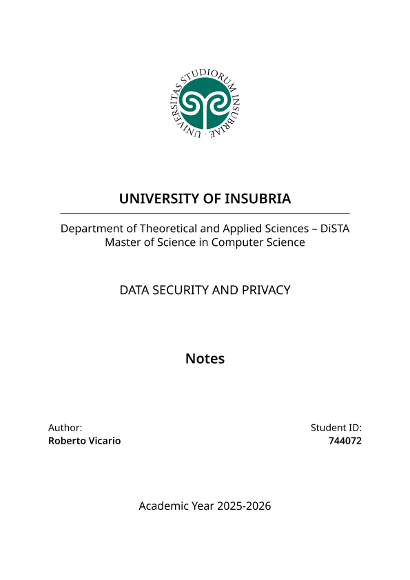
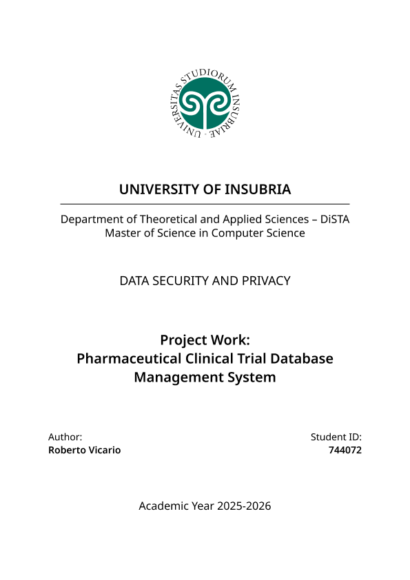

|  |
| - |

# Data Security and Privacy, MSc Course @ University of Insubria

This repository contains my project work for the ***Data Security and Privacy*** course at the ***University of Insubria***, part of the ***MSc in Computer Science***.

## Overview

You can easily download my course materials below, remember to use it responsibly and cite it if you reference it.

## Materials

| <a href="https://raw.githubusercontent.com/robertovicario/uninsubria-DATA_SECURITY_PRIVACY/main/dist/Notes.pdf"></a> | <a href="https://raw.githubusercontent.com/robertovicario/uninsubria-DATA_SECURITY_PRIVACY/main/dist/Project-Work.pdf"></a> |
| - | - |

## Credits

> [!WARNING]
>
> Please use this project responsibly, it was created by me for an exam session that I completed at _University of Insubria_. If you use or reference this project, please cite it as follows:
>
> ```bib
> @software{Vicario_Pharmaceutical_Clinical_Trial,
>     author = {Vicario, Roberto},
>     title = {{Pharmaceutical Clinical Trial Database Management System}},
>     url = {https://github.com/robertovicario/uninsubria-DATA_SECURITY_PRIVACY},
>     version = {1.0.0}
> }
> ```

## License

This project is distributed under <a href="https://creativecommons.org/licenses/by-nc-sa/4.0" target="_blank">Creative Commons Attribution-NonCommercial-ShareAlike 4.0 International</a>. You can find the complete text of the license in the project repository.
